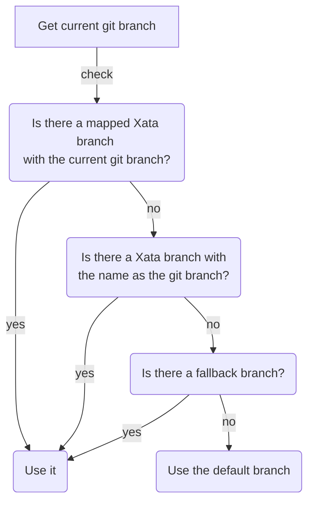

# Branches & Git Integration

Xata is a _branchable_ database. Developers can checkout new branches of their database schemas, make changes safely, and merge them into their main branch. This triggers a zero-downtime migration.

Some commands are integrated with git. Specifically, those related to branching. Xata uses the following algorithm in development in order to calculate which xata branch needs to be used:

The current git branch is used in the first two cases in the algorithm:

- If a git branch has been explicitly mapped to a Xata branch, the associated branch is used
- Otherwise, if a Xata branch with the same name as the git branch exists, we use that.

If none of them apply, the **fallback branch** is used. This is a safety measure to avoid connecting to your production database. If you are developing a feature that doesn't require schema changes, you'll have a git branch, but not an associated Xata branch. In this case to prevent using the default Xata branch—which could be production—we allow specifying a `XATA_FALLBACK_BRANCH` in your local `.env` file. You can have a personal branch with your username for example.

If none of the above apply, the default Xata branch is used.
