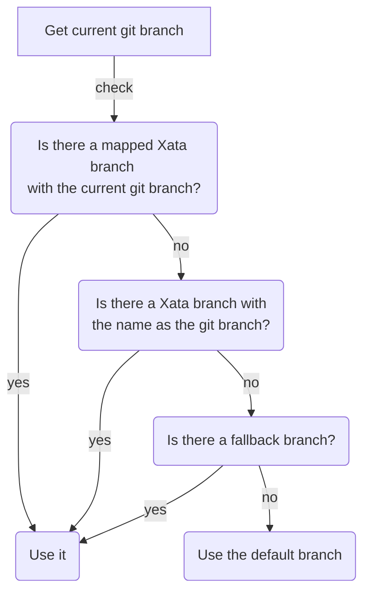

# Code Generation

We strongly recommend using the CLI to generate your Xata client for you. The Xata client is a class that you can instantiate in your project that will help you query Xata in a familiar way. This will help make your queries to Xata predictable and safe, while also providing autocomplete and safety.

Once you have a generated Xata client, you can import it into your project and use it. The [SDK Playground](/getting-started/clients#ui-playground) in the Xata web interface can serve as a companion for you to build and test out your queries. Once you're happy with them, you copy and paste them into your project.

As your schema changes, running `xata codegen` will consistently refresh your auto-generated Xata client with the latest schema for your database branch.

## Branches & Git Integration

Xata is a _branchable_ database. Developers can checkout new branches of their database schemas, make changes safely, and merge them into their main branch. This triggers a zero-downtime migration.

Some commands are integrated with git. Specifically, those related to branching. Xata uses the following algorithm in development in order to calculate which xata branch needs to be used:

The current git branch is used in the first two cases in the algorithm:

- If a git branch has been explicitly mapped to a Xata branch, the associated branch is used
- Otherwise, if a Xata branch with the same name as the git branch exists, we use that.

If none of them apply, the **fallback branch** is used. This is a safety measure to avoid connecting to your production database. If you are developing a feature that doesn't require schema changes, you'll have a git branch, but not an associated Xata branch. In this case to prevent using the default Xata branch—which could be production—we allow specifying a `XATA_FALLBACK_BRANCH` in your local `.env` file. You can have a personal branch with your username for example.

If none of the above apply, the default Xata branch is used.

## Editing Your Database Schema

You can edit the schema in the CLI with `xata schema edit` which provides an interactive menu to make schema changes. Alternatively `xata schema edit --source` will open your default editor, where you can edit the current schema or paste the desired target schema. To specify the default editor, set the executable command in the EDITOR environment variable.

You can also quickly jump to the Web UI with `xata browse` and edit the schema there.

If you edit the schema in the CLI, the code generator will be used if it's configured after applying the schema changes. If you choose to edit the schema in the web UI, remember to execute `xata codegen` when you are back to your code.

## Importing Your Database Schema

You can retrieve your database schema with the command `xata schema dump`, optionally with a `--file schema.json` to write the output schema to a file.

You can import a schema file to your project's database with the command `xata schema upload schema.json`.

Or, while initiating a new project your can directly apply a schema from a file using `xata init --schema schema.json`.

## Next Steps

Now that your project is set up with the Xata CLI, and if you've opted to use code generation (recommended), we suggest exploring the [TypeScript/JavaScript SDK](/typescript-client/overview) section of the documentation to get up to speed using it.
